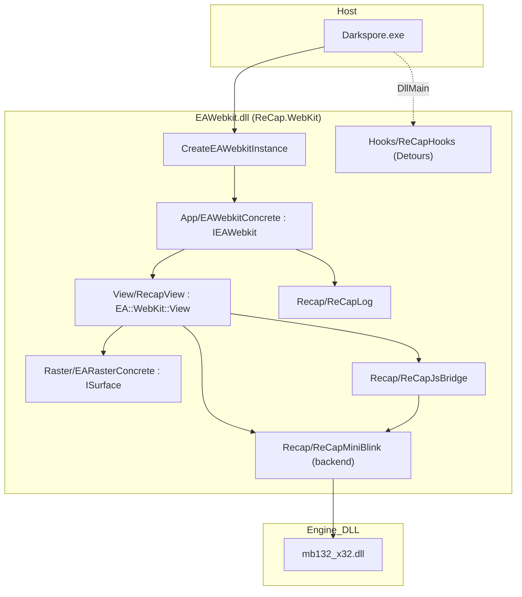
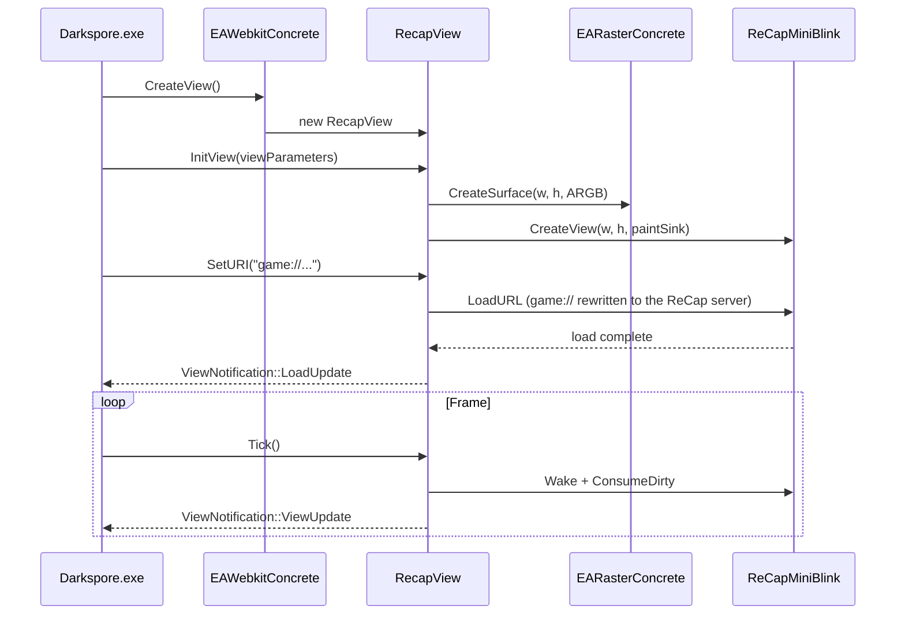

# Architecture

This document explains how ReCap.WebKit satisfies the Darkspore client's browser contract, how the
source is organized, and the design decisions behind it. For build and deploy instructions see the
[README](../README.md).

## The binary contract

Three facts, verified with `dumpbin` and confirmed at runtime, define everything else:

1. **Dynamic load, one export.** Darkspore does not list `EAWebkit.dll` in its import table. It
   calls `LoadLibrary("EAWebkit.dll")` and `GetProcAddress("CreateEAWebkitInstance")`. That single
   `__cdecl` function (exported with a clean name through a `.def` file) is the only symbol resolved
   by name.

2. **Everything else is C++ vtables.** `CreateEAWebkitInstance` returns an `EA::WebKit::IEAWebkit*`.
   The client calls its virtual methods to configure the engine and create views; it then drives
   each `EA::WebKit::View` (input events, `Tick`), reads pixels from the view's
   `EA::Raster::ISurface`, and implements `EA::WebKit::ViewNotification` to receive load, draw, and
   JavaScript callbacks.

3. **The headers are the spec.** EA's public EAWebKit headers are WebCore-free: they include only
   other public EAWebKit headers, EARaster, EABase, forward declarations, and opaque fixed-size
   EASTL wrappers. They compile standalone, so ReCap.WebKit reuses them verbatim as the `Abi/`
   contract.

### Vtable order comes from the header

Because `EAWebkitConcrete` derives from `IEAWebkit` and `RecapView` derives from `View`, the
compiler emits each vtable in the exact order declared in EA's headers — no manual offset matching
is needed. The only obligation is to **define every virtual**: a working body for the methods the
client calls, and a trivial stub for the rest, so the vtable is complete and the DLL links.

## Layers

| Layer                  | Type implemented            | Responsibility                                                        |
| ---------------------- | --------------------------- | -------------------------------------------------------------------- |
| `Source/App`           | `EA::WebKit::IEAWebkit`      | Engine lifetime, parameters, view registry, JavaScript value factory |
| `Source/View`          | `EA::WebKit::View`          | Per-view init, input routing, paint sink, navigation, JS binding     |
| `Source/Raster`        | `EA::Raster::ISurface`      | ARGB pixel buffer the client blits to the screen                     |
| `Source/Recap`         | MiniBlink backend + bridge  | Engine wrapper (paint/input/focus), JS bridge, crash-safe logger     |
| `Source/Hooks`         | Detours trampolines         | Host redirect, ProtoSSL cert bypass, DPI source, WM_QUIT re-post     |
| `Source/Stl`, `Eastl`  | EASTL wrappers + sources    | ABI string/container types and their out-of-line dependencies        |

## View lifecycle

## Host-process hooks

EAWebkit.dll shares the address space of `Darkspore.exe`, so installing Detours trampolines from
`DllMain` lets it adjust process-wide behavior the retail client needs to reach a ReCap server:

- **`ws2_32` redirect** — `gethostbyname` and `connect` are pointed at the host in `recap.cfg`, and
  HTTP port 80 is remapped to the configured REST port.
- **ProtoSSL certificate bypass** — the client's statically linked certificate and hostname checks
  are forced to succeed (gated on `recap.cfg`'s `ssl_bypass`), so a self-signed server certificate
  is accepted.
- **DPI source neutralization** — MiniBlink is fed 96 DPI (caller-filtered to `mb132_x32.dll`) so
  page layout matches surface pixels while the rest of the process stays DPI-aware.
- **WM_QUIT re-post** — MiniBlink's nested message pump consumes the launcher's quit message; the
  hook re-queues it so Play, Exit, and Close work.

Offsets are specific to retail 5.3.0.127 and are base-relative.

## Data folder

At runtime the DLL resolves its own module directory and creates a `ReCapWebKit/` subfolder beside
`EAWebkit.dll`. The log (`ReCap.WebKit.log`), cookie jar (`cookies.dat`), and `LocalStorage/` all
live there, keeping the game's `DarksporeBin` directory uncluttered. The path is module-relative so
it survives the client reloading the DLL and does not depend on the working directory.

## Dependency strategy

- **EASTL** — EA's containers appear in the ABI as opaque fixed-size wrappers. ReCap.WebKit vendors
  the matching EASTL headers and the few out-of-line sources the wrappers pull in (the empty-string
  singleton, the hashtable prime-rehash policy, the fixed-pool initializer, the red-black tree).
- **Microsoft Detours** — used for the host hooks. CMake prefers a prebuilt local tree and otherwise
  fetches and compiles Detours v4.0.1 from source, so the build is self-contained on CI.
- **MiniBlink** — `mb132_x32.dll` is loaded at runtime via `mbSetMbMainDllPath`; only its header is
  needed at build time, so there is no import library.

## Build internals

- **Static CRT.** `CMAKE_MSVC_RUNTIME_LIBRARY` selects `/MT` for every target, so the redistributed
  DLL does not depend on a Visual C++ runtime DLL on the player's machine.
- **`char8_t`.** EABase typedefs `char8_t` as `char`, which collides with the native C++20/23 type
  under `/std:c++latest`; `/Zc:char8_t-` restores the typedef and keeps the ABI stable.
- **Mixed C and C++.** The vendored `recapredirect.c` is compiled as C; the C++-only switches are
  applied through `$<$<COMPILE_LANGUAGE:CXX>:...>` generator expressions.
- **Single export.** `Source/EAWebkit.def` exports only `CreateEAWebkitInstance`;
  `EAWEBKIT_STATIC_LINKAGE` keeps the rest of the EAWebKit and EARaster API as ordinary internal
  symbols.

## Design notes

A recurring lesson while porting: the retail client is strict, and any non-WebCore method left as a
null-returning stub becomes a null dereference inside the client. Three lobby-entry crashes traced
back to omissions that EA's full build provided implicitly:

- `GetEARasterInstance` must lazily install a default `EARasterConcrete`; the client never sets one,
  so without the lazy default `View::InitView` dereferences null while creating its surface.
- The JS-bridge view registry must release its slot when a view is destroyed; a fixed, never-freed
  table exhausted its slots once the hub opened, silently dropping the hub's `Client.*` bindings.
- The `JavascriptValue` family (`CreateJavaScriptValue`, the array and hash-map helpers) must be
  real allocations, not null stubs; the client builds these to push lobby and friends data into the
  page.

The general rule: every interface method the client may call needs a faithful body, even when it
looks peripheral. Stubs are safe only for methods the retail client provably never invokes.

## Porting method

For `EAWebkitConcrete` and `RecapView`, the implementations start from EA's proven `.cpp` files,
keep the MiniBlink path, and reduce the WebCore-only methods to stubs. The headers guarantee the
vtable; the MiniBlink path is proven against the retail client. This reuses working logic while
dropping WebCore, JavaScriptCore, and the internal sources from the build entirely.
