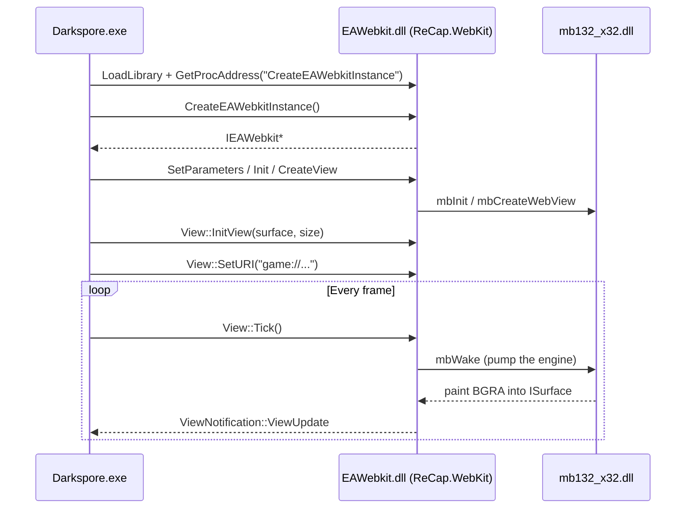
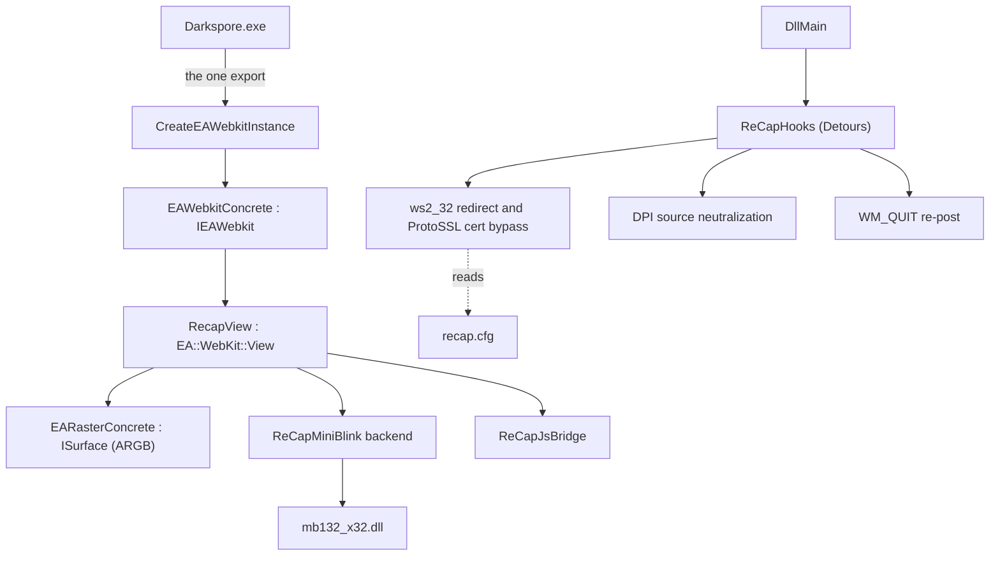

<div align="center">
  
</div>

<h1 align="center">ReCap.WebKit</h1>
<p align="center">A clean-room, modern replacement for Darkspore's <code>EAWebkit.dll</code> — a small native DLL the retail client loads in place of EA's circa-2008 WebKit fork, backed by MiniBlink (Chromium 132), with none of the unused WebCore / EASTL / JavaScriptCore legacy compiled in.</p>

---

Darkspore (Maxis, 2011) renders its launcher and several in-game panels — announcements, account
registration, the lobby hub, the friends list — through an embedded browser shipped as
`EAWebkit.dll`. ReCap.WebKit reimplements that DLL's binary contract over a modern engine, so the
unmodified retail client renders those pages without the legacy browser.

It is part of the [ReCap](https://github.com/JeanxPereira/ReCap) project, which re-implements the
Darkspore servers so the game is playable offline.

## Status

Working end to end against the retail client (5.3.0.127):

- Launcher renders, every button works.
- In-game announcement and registration views render and accept mouse and keyboard input.
- The lobby hub and friends list load without crashing the client.

## How Darkspore loads it

Darkspore does not statically import `EAWebkit.dll`; it loads it dynamically and resolves a single
exported symbol, `CreateEAWebkitInstance`. Everything else crosses the boundary as C++ virtual
tables, so the binary contract is small in surface but exact in layout.



The DLL's surface is reused from EA's public EAWebKit headers, so the vtable order, struct sizes,
member offsets, and calling convention are guaranteed identical. Only the method bodies the client
actually calls are reimplemented — over MiniBlink. See [Docs/Architecture.md](Docs/Architecture.md)
for the full contract and the reasoning behind it.

## Architecture at a glance



## Building

The DLL is **x86 only** — Darkspore is a 32-bit process and MiniBlink runs in-process. Build from
an x86 MSVC developer environment with CMake and Ninja:

```bat
cmake -S . -B build -G Ninja -DCMAKE_BUILD_TYPE=RelWithDebInfo
cmake --build build
```

The output is `build/EAWebkit.dll`.

Microsoft Detours is the only external dependency, and CMake resolves it automatically:

- If a prebuilt Detours tree is available, pass `-DRECAP_DETOURS_DIR=<path>` to use it directly.
- Otherwise CMake fetches and compiles Detours v4.0.1 from source. No manual setup is required, so a
  clean machine or CI runner builds with the two commands above.

Continuous integration in [`.github/workflows/build.yml`](.github/workflows/build.yml) builds the
DLL on every push and attaches a packaged archive to GitHub Releases on `v*` tags.

## Deploying

Place these next to `Darkspore.exe` (the `DarksporeBin` folder of the install):

| File            | Source                                         |
| --------------- | ---------------------------------------------- |
| `EAWebkit.dll`  | this project's build output                    |
| `mb132_x32.dll` | MiniBlink 132, x86 (obtained separately)       |
| `recap.cfg`     | copy of [`recap.cfg.sample`](recap.cfg.sample) |

At runtime the DLL creates a `ReCapWebKit/` data folder next to itself for its log, cookies, and
local storage, keeping the game directory clean:

```text
DarksporeBin/
├── EAWebkit.dll
├── mb132_x32.dll
├── recap.cfg
└── ReCapWebKit/
    ├── ReCap.WebKit.log
    ├── cookies.dat
    └── LocalStorage/
```

## Configuration

`recap.cfg` points the game's web layer at a ReCap server:

```ini
host=127.0.0.1     ; dotted IPv4 of the ReCap server
http_port=8033     ; ReCap REST port
ssl_bypass=1       ; 1 = accept the server's self-signed certificate
```

## Logging

The DLL writes a crash-safe log to `ReCapWebKit/ReCap.WebKit.log`. The ReCap server can optionally
mirror it into its own console under a `WebKit` category by tailing the file — no coupling, no
dependency on the DLL. Enable it on the server side:

```bat
dotnet run --project ReCap.Server -- --log-level=WebKit:debug
```

The server derives the log path from the resolved game install, or accepts an explicit
`--webkit-log=<file>`.

## Repository layout

```text
ReCap.WebKit/
├── Abi/             EA's public EAWebKit / EARaster / EABase headers (the ABI contract)
├── Source/
│   ├── App/         EAWebkitConcrete: the IEAWebkit implementation
│   ├── View/        RecapView: the EA::WebKit::View implementation
│   ├── Raster/      EARasterConcrete: the ARGB ISurface
│   ├── Recap/       MiniBlink backend, JS bridge, logger
│   ├── Hooks/       Detours host-process hooks (redirect, cert bypass, DPI, WM_QUIT)
│   ├── Stl/         opaque EASTL string and container wrappers (ABI types)
│   └── Eastl/       vendored EASTL out-of-line sources
├── ThirdParty/      EASTL / EAAssert / EAIO / wtf shims, recap.cfg parser
├── Docs/            Architecture.md
├── CMakeLists.txt
├── recap.cfg.sample
└── .github/workflows/build.yml
```

## Constraints

- **x86 only.** Darkspore is 32-bit; the DLL and MiniBlink are 32-bit and in-process. CEF and
  Ultralight are 64-bit-only and therefore not options.
- **MSVC ABI.** The vtable and `thiscall` layout must match what Darkspore (built with VS2008)
  expects. Modern MSVC emits a compatible x86 ABI; struct layout is kept exact by reusing EA's
  public headers verbatim.
- **C# is not viable for the DLL.** The host calls native vtables in-process; a managed assembly
  would require a heavy C++/CLI and CLR-hosting shim. C# stays out-of-process (ReCap.Server).

## Credits and licensing

ReCap.WebKit reuses EA's **public** EAWebKit ABI headers and links Microsoft Detours and MiniBlink;
those components retain their respective licenses. It reimplements only the behavior the retail
client requires and contains none of EA's WebCore, JavaScriptCore, or internal sources.
